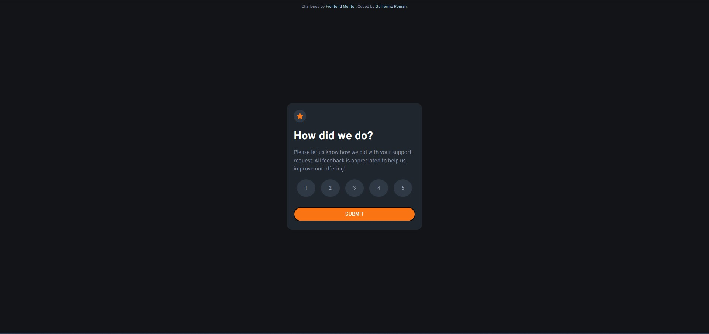

# Frontend Mentor - Interactive rating component solution

This is a solution to the [Interactive rating component challenge on Frontend Mentor](https://www.frontendmentor.io/challenges/interactive-rating-component-koxpeBUmI). Frontend Mentor challenges help you improve your coding skills by building realistic projects. 

## Table of contents

- [Overview](#overview)
  - [The challenge](#the-challenge)
  - [Screenshot](#screenshot)
  - [Link](#link)
- [My process](#my-process)
  - [Built with](#built-with)
  - [What I learned](#what-i-learned)
- [Author](#author)

## Overview

### The challenge

Users should be able to:

- View the optimal layout for the app depending on their device's screen size
- See hover states for all interactive elements on the page
- Select and submit a number rating
- See the "Thank you" card state after submitting a rating

### Screenshot



### Link

- Live Site URL: (https://rating-project.netlify.app/)

## My process

### Built with

HTML, CSS, Javascript

### What I learned

Creating this project, I learned how to use javascript event listeners to create a non-static page

```js
const selectedText = document.querySelector("#selected-text");
document.querySelectorAll(".number-button").forEach(item => {
    item.addEventListener('click', event => {
        switch (item.value) {
            case "1":
                selectedText.innerHTML = "You selected 1 out of 5";
                break;
            case "2":
                selectedText.innerHTML = "You selected 2 out of 5";
                break;
            case "3":
                selectedText.innerHTML = "You selected 3 out of 5";
                break;
            case "4":
                selectedText.innerHTML = "You selected 4 out of 5";
                break;
            case "5":
                selectedText.innerHTML = "You selected 5 out of 5";
                break;
        }
    })
})
```

## Author

- Frontend Mentor - [@RomanGuillermo](https://www.frontendmentor.io/profile/romanguillermo)